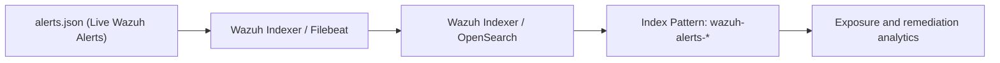

# TcpRecon System Architecture

> **Document status:** This document separates verified current behaviour from target architecture. A component is described as **implemented** only when it exists on the active branch and has supporting verification. **Planned** sections describe the intended vertical slice and must not be read as current runtime behaviour.

## 1. Purpose and scope

TcpRecon is a Go-based authorised network-observation engine and continuous Attack Surface Monitoring (ASM) edge pipeline. It performs TCP full-connect reconnaissance and selected protocol-aware UDP probes, collects Layer 7 service and TLS cryptographic metadata, reconciles observations into versioned bbolt lifecycle state, enriches targets via local CIDR routing rules, computes deterministic risk scores, and streams structured NDJSON telemetry into Wazuh SIEM for automated detection and alerting.

The project is not intended to outperform or replace mature scanners. Its engineering objective is to demonstrate a complete and reproducible pipeline:

```text
network observation → normalized state → asset enrichment → risk scoring → lifecycle event → detection → analysis → remediation evidence
```

The scanner, stable identity helpers, explicit scan-completion boundary, versioned lifecycle-state subsystem, Layer 7 TLS inspection, LPM asset enrichment, deterministic risk engine, Wazuh detection pipeline (rules 100050–100058 with automated lifecycle scripts), and OpenSearch remediation analytics with visual dashboards are now runtime-active and verified.

## 2. Design principles

1. **Correctness before scale.** Input parsing, cancellation, state classification, and event semantics must be trustworthy before throughput is optimized.
2. **Bounded concurrency.** Worker pools and bounded channels prevent unbounded goroutine and memory growth.
3. **Controlled network impact.** A global rate limiter controls probe starts independently of concurrency. The rate limiter burst capacity must always be hardcoded to 1 to prevent NAT state exhaustion.
4. **Atomic telemetry.** Standard output (`stdout`) is reserved strictly for pure NDJSON telemetry (one event per line); all diagnostic summaries, progress counters, and errors route strictly to standard error (`stderr`).
5. **Single ownership of persistent state.** Runtime coordination serializes observation persistence and finalization after scanner writers are quiescent.
6. **No false remediation.** Partial, failed, or cancelled scans preserve existing committed baselines and cannot emit `service.closed` remediation events.
7. **Zero-nested-arrays invariant.** Telemetry envelopes must strictly contain scalar primitives or nested single-instance objects; dynamic slices and arrays are prohibited to prevent schema-flattening failures in `wazuh-analysisd`. Multi-factor values such as `risk.reasons` must be serialized as comma-delimited scalar strings.
8. **Configuration safety contract.** SIEM deployment automation scripts must never use destructive multiline text substitution on `ossec.conf`. XML mutations require structured DOM manipulation and pre-flight validation via `/var/ossec/bin/wazuh-analysisd -t` prior to service reload.
9. **Reproducible operations.** Wazuh rules, fixtures, mappings, dashboards, and deployment instructions belong in Git under `deployments/`.
10. **Honest claims.** Performance and reliability claims require tests and published evidence.

## 3. System context

### 3.1 Current scanner pipeline

**Status: implemented and verified through Phase D live SIEM alerting.**

```mermaid
flowchart LR
  Scope[Authorised target input] --> Input[Input source selection]
  Input --> Parser[Streaming target parser / resolver]
  Parser --> Producer[Target producer]
  Producer --> Raw[rawJobs]
  Raw --> Router[Protocol router]
  Router --> TCPQ[tcpJobs]
  Router --> UDPQ[udpJobs]
  TCPQ --> TCP[TCP / TLS worker pool]
  UDPQ --> UDP[Selected UDP worker pool]
  TCP --> Results[Positive ScanResults]
  UDP --> Results
  Results --> Persist[Temporary observation persister]
  Persist <--> Bolt[(schema-v1 scoped state)]

  Producer -. producerErr .-> Completion[Scanner completion]
  Router -. routerErr .-> Completion
  UDP -. workerErr .-> Completion
  TCP -. workersDone .-> Completion
  UDP -. workersDone .-> Completion

  Persist -. stateErr .-> Final[Final scan completion]
  Completion --> Final
  Final --> Reconcile[FinalizeCurrentScan]
  Reconcile --> Bolt
  Reconcile --> Emit[Lifecycle & Risk Emitter]
  Emit --> Stdout[stdout: Pure NDJSON Events]

  Stdout --> Localfile["/var/log/tcprecon/events.ndjson"]
  Localfile --> WazuhLog[wazuh-logcollector]
  WazuhLog --> Analysisd[wazuh-analysisd: Rules 100050-100058]
  Analysisd --> Alerts["/var/ossec/logs/alerts/alerts.json"]

  TCP -. diagnostics .-> Stderr[stderr]
  UDP -. diagnostics .-> Stderr
  Persist -. diagnostics .-> Stderr

  ScopeDef[ScanScope.ID] --> Bolt
  ServiceDef[ServiceIdentity.Key v1] --> Bolt
```



Verified Phase D completion behaviour:

- `scanner.Run` exposes the result stream and a separate asynchronous `ScanCompletion` channel;
- result-channel closure proves result production has ended, but does not by itself prove scan success;
- producer errors distinguish cancellation, target parse failure, and target-resolution failure;
- router cancellation is propagated rather than discarded;
- worker-level failure can make the scan incomplete when intended work cannot be executed;
- every observation is offered to temporary persistence and the first persistence failure remains sticky;
- the CLI combines scanner completion with temporary-state persistence before finalization;
- `ScanCompletion.Successful()` is true only for `completed` with no error;
- `mapDeltaToLifecycleEvent` evaluates state deltas, enriches asset context via LPM CIDR matching, evaluates 0–100 deterministic risk scores, and serializes canonical NDJSON;
- telemetry appends to `/var/log/tcprecon/events.ndjson`, which is actively monitored by `wazuh-logcollector`;
- `wazuh-analysisd` natively parses fields under `data.*`, evaluates hierarchical rules (100050–100058), and commits security alerts directly to `/var/ossec/logs/alerts/alerts.json`.

### 3.2 Target lifecycle vertical slice

**Status: implemented and verified (Phase E).**



A cancelled, failed, partial, or unresolved scan must preserve the previous committed baseline and must not generate `service.closed`.

## 3.3 Implementation progress

| Workstream | Result | Status |
| --- | --- | --- |
| **Phase A: Repository baseline** | Input parsing, CLI validation, IPv6 safety, stdout/stderr stream separation, unit & race test suite. | Complete and verified |
| **Phase B1-B7: Lifecycle state** | Stable identities, versioned bbolt baseline, lifecycle event NDJSON emission. | Complete and verified |
| **Phase C1-C3: TLS & Risk** | Non-fatal TLS probes, zero-alloc LPM CIDR engine, deterministic 0–100 scoring. | Complete and verified |
| **Phase D1-D2: Wazuh Detection** | Rules 100050–100058, `<localfile>` NDJSON pipeline, XML DOM safety. | Complete and verified |
| **Phase E: OpenSearch Analytics** | Schema mappings, index patterns (`wazuh-alerts-*`), visual remediation analytics dashboards. | Complete, runtime-active, and verified |

The active identity chain is:

```text
scope_id -> service_key -> event_id
```

`finding_id` is deliberately deferred. It will be introduced only if one service can own multiple independent security findings rather than one lifecycle history.

## 4. Major components

### 4.1 Input source selection

Target input may originate from a positional target, local file, standard input, or an authorised remote list. Input-source selection must be explicit and mutually unambiguous.

Required behaviour:

- reject multiple conflicting sources;
- reject excessive positional arguments;
- validate URLs before network fetching;
- resolve hostnames without terminating the whole process on one failure;
- preserve target identity alongside resolved addresses;
- stream large sources instead of loading them completely into memory.

### 4.2 Streaming parser

The parser reads through `io.Reader` and produces scan jobs. Large individual CIDRs should eventually be expanded incrementally so producer memory remains bounded.

The parser is subject to backpressure. When work queues fill, parsing pauses until workers consume jobs.

`StreamTargets` preserves these scan-level conditions:

- context cancellation;
- target parse/job-production failure;
- target-resolution failure;
- underlying input-reader failure, classified under the parse/production boundary;
- `nil` when target production completes successfully.

The producer-side send path checks `ctx.Err()` before a context-aware channel send to avoid selection races on cancellation.

### 4.3 Dispatcher and worker pools

The dispatcher routes jobs to protocol-specific worker pools.

- TCP workers use full-connect scanning through context-aware dials.
- UDP workers send selected protocol-aware payloads and classify positive replies conservatively.
- Channel direction types document ownership and prevent accidental misuse.
- `sync.WaitGroup` and channel-closure ownership are centralised.
- Worker counts are validated and bounded.

Asynchronous stage outcomes are explicit:

- `startTargetProducer` owns `rawJobs` closure and publishes one producer error result;
- `startJobRouter` owns `tcpJobs` and `udpJobs` closure and publishes one router error result;
- worker completion is signalled separately from result-channel closure;
- worker failures are captured without blocking error-reporting goroutines;
- `startScannerCompletion` combines producer, router, worker, context, and worker-termination evidence into one scanner-level completion result.

Unsupported UDP work is no longer silently skipped. If an intended UDP port has no supported payload, the UDP worker records a worker-level failure, continues draining queued jobs so the router cannot be stranded, and returns the retained error when its job channel closes.

Ordinary probe failures remain per-service outcomes rather than scan-level worker failures. Concurrency controls the number of simultaneous operations; the rate limiter controls how quickly new probes begin.

### 4.4 Network operations

Socket operations require deadlines. TCP dials use the shared context. UDP cancellation is deadline-bound and monitored so cancellation is not reported as successful completion.

TCP observations distinguish established connections from operational failure. A timeout alone must not be presented as proof of firewall filtering or service closure.

UDP classification is protocol-dependent and more uncertain. Positive application responses are stronger evidence than silence.

### 4.5 Protocol metadata & TLS inspection

- HTTP handlers may send a bounded request to client-first services.
- Non-fatal TLS handshakes collect negotiated version, cipher suite, validity boundaries (`NotBefore`, `NotAfter`), and certificate authority validation.
- Handshake timeouts or validation failures retain Layer 4 `open` state and capture diagnostic hints without dropping observations.
- Reads and banners must be size-limited to prevent buffer exhaustion. Raw server content is untrusted input and must not produce unbounded events.

### 4.6 Observation normalization

Internal worker structures should not become the long-term public telemetry contract. A dedicated event model isolates lifecycle events from implementation details.

Stable comparison inputs include:

- protocol;
- normalized IP address;
- port;
- service state;
- normalized service name;
- bounded normalized banner;
- certificate fingerprint or selected stable certificate fields.

Unstable fields must not influence observation fingerprints: scan timestamp, latency, event ID, temporary OS error text, and worker/rate/timeout settings.

### 4.7 Stable scan-scope identity

Status: implemented, runtime-active, and verified.

`internal/scanner/scope.go` defines `ScanScope` and derives a deterministic ID from a versioned canonical representation containing:

- normalized target definitions;
- a deduplicated and sorted TCP port set;
- a deduplicated and sorted UDP port set.

Target canonicalization trims surrounding whitespace, lowercases hostnames, masks CIDRs, canonicalizes IPv4/IPv6 text through `net/netip`, and unmaps IPv4-mapped IPv6 addresses. The canonical value is serialized as JSON and hashed with SHA-256. The schema version is included in the canonical value so future identity changes can be explicit.

### 4.8 Stable service identity

Status: implemented, runtime-active, and persistently verified.

`internal/scanner/service_identity.go` defines `ServiceIdentity` with exactly four identity inputs:

- `scope_id`;
- IP address;
- port;
- protocol.

The canonical representation is versioned, serialized as JSON, hashed with SHA-256, and encoded as lowercase hexadecimal. Target hostname, banners, TLS metadata, service state, scan IDs, timestamps, and execution settings are strictly excluded.

### 4.9 Explicit scan completion

Status: implemented and verified.

The core model is:

```go
type ScanCompletion struct {
    Status ScanStatus
    Err    error
}
```

`Successful()` is intentionally strict (`Status == completed && Err == nil`). The status vocabulary includes `completed`, `cancelled`, `resolution_failed`, `parse_failed`, `worker_failed`, and `state_failed`. Missing or internally inconsistent completion evidence fails closed.

### 4.10 Lifecycle state and bbolt

Status: runtime-active in CLI.

Workers do not write directly to bbolt. Runtime orchestration consumes results and writes them to the owned temporary scan partition.

Persistence error behaviour is sticky: the first write failure is authoritative, drainage continues until writers are quiescent to prevent deadlocks, and finalization receives `state_failed`.

Schema v1 uses this lifecycle layout:

```text
metadata/schema_version
metadata/created_at
scope/<scope_id>/baseline/<service_key>/...
scope/<scope_id>/scan/<scan_id>/<service_key>/...
```

Baseline and temporary current-scan records are keyed by stable `service_key` within `scope_id`.

### 4.11 Asset Enrichment & Context Mapping

**Status: implemented and verified.**

The `internal/enrichment` package utilizes a zero-allocation Longest Prefix Match (LPM) CIDR routing table to apply local asset context (`environment`, `criticality`, `owner`) to discovered endpoints. Unmatched addresses fail securely to `"unassigned"` without allocating on the evaluation path.

### 4.12 Deterministic Risk Scoring

**Status: implemented and verified.**

The `internal/risk` package computes explainable scores natively without relying on SIEM rule matrices. Risk Policy v1.0 implements:

- Integer bounding (0 to 100 max points);
- Mathematical integration of exposure severity (exposed datastores, cleartext), cryptographic posture (deprecated TLS, invalid certs), and asset criticality (`tier-0` multiplier);
- Remediation Gating: `service.closed` events forcibly evaluate to score `0` and `severity: "informational"`;
- Zero-Nested-Arrays Serialization: Multi-factor findings are encoded strictly as scalar, comma-delimited strings (`"reasons": "deprecated_tls,exposed_datastore"`).

## 5. Lifecycle reconciliation

Status: implemented, runtime-active, and verified.

State deltas compare a successfully finished scan with the previous committed baseline for the same scope:

```text
current - previous                         = opened
current ∩ previous with different hash    = changed
previous - current                         = closed
previously closed and observed again       = reopened
```

### 5.1 Commit rule

```text
ScanCompletion.Successful() == true  -> baseline promotion may proceed
ScanCompletion.Successful() == false -> baseline promotion forbidden
```

`FinalizeCurrentScan` owns the state transition: successful scans atomically reconcile and replace the committed baseline, while incomplete scans produce no changes and attempt targeted temporary-state discard. Temporary observations from incomplete scans are discarded rather than promoted to prevent partial runs from being reported as successful remediation.

### 5.2 Stable identifiers

| Identifier | Contract | Current status |
| --- | --- | --- |
| `scan_id` | Unique to one execution | Runtime-generated 128-bit lowercase hexadecimal ID with exclusive reservation |
| `scope_id` | Stable hash of canonical targets plus separate TCP and UDP port sets | Runtime-active baseline partition |
| `service_key` | Stable identity of one service within a scope: canonical IP + port + protocol under `scope_id` | Runtime-active persistent v1 key |
| `event_id` | Unique identity of one lifecycle event: `{scan_id}-{ip}-{protocol}-{port}` | Runtime-active |
| `finding_id` | Separate security-finding identity | Deferred until one service can own multiple independent findings |

The active identity chain is `scope_id -> service_key -> event_id`.

## 6. Event pipeline

Status: implemented and verified.

TcpRecon emits one versioned NDJSON object per lifecycle event adhering strictly to `docs/EVENT_SCHEMA.md`:

```text
stdout → telemetry only (pure NDJSON)
stderr → diagnostics only
```

Canonical lifecycle vocabulary:

- `service.opened`: new service observed with no active baseline record in the scope;
- `service.changed`: open service mutates Layer 7 banner or TLS metadata;
- `service.reopened`: previously closed service observed open again;
- `service.closed`: previously open service absent or closed following a successful scan.

The event envelope rigidly forbids nested arrays to maintain explicit parsing compatibility with Wazuh's `analysisd` decoder.

## 7. Wazuh integration

**Status: implemented, verified, and operational on manager.**

Wazuh ingests the event sink natively via a JSON `<localfile>` configuration without custom pre-decoders:

```xml
<localfile>
  <log_format>json</log_format>
  <location>/var/log/tcprecon/events.ndjson</location>
</localfile>
```

Repository-owned integration assets are structured as:

```text
deployments/wazuh/
├── config/
│   └── tcprecon-localfile.xml
├── rules/
│   └── tcprecon_rules.xml
├── fixtures/
│   ├── service-opened.ndjson
│   ├── service-changed.ndjson
│   ├── service-closed.ndjson
│   ├── deprecated-tls.ndjson
│   └── foreign-event.ndjson
└── scripts/
    ├── install-rules.sh
    └── uninstall-rules.sh
```

### 7.1 Rule hierarchy (`tcprecon_rules.xml`)

1. **Rule 100050 (Level 0):** Base JSON anchor matching parent Suricata rule `86600` and asserting `data.scanner.name == "tcprecon"`.
2. **Rule 100051 (Level 3):** Matches `data.event_type == "service.opened"`.
3. **Rule 100052 (Level 3):** Matches `data.event_type == "service.reopened"`.
4. **Rule 100053 (Level 4):** Matches `data.event_type == "service.changed"`.
5. **Rule 100054 (Level 2):** Matches `data.event_type == "service.closed"` (informational remediation).
6. **Rule 100055 (Level 5):** Evaluates `data.risk.score` in `[1, 39]` with description interpolation.
7. **Rule 100056 (Level 8):** Evaluates `data.risk.score` in `[40, 69]` with description interpolation.
8. **Rule 100057 (Level 12):** Evaluates `data.risk.score` in `[70, 100]` (critical security finding).
9. **Rule 100058 (Level 10):** Cryptographic violation trigger evaluating `data.risk.reasons` via PCRE2 patterns (`\bdeprecated_tls\b`, `\buntrusted_cert\b`).

### 7.2 Deployment automation (`scripts/`)

- `install-rules.sh`: Shell installer supporting portable relative paths. Stages rules, prepares `/var/log/tcprecon/events.ndjson` with `wazuh:wazuh` ownership, injects the `<localfile>` stanza, gates reloads behind `/var/ossec/bin/wazuh-analysisd -t`, and restarts `wazuh-manager`.
- `uninstall-rules.sh`: Safe uninstallation script using Python's `xml.etree.ElementTree` DOM parser to cleanly excise the `<localfile>` entry without regex truncation, validates syntax, and restarts `wazuh-manager`.

## 8. OpenSearch Analytics Architecture (Phase E)

**Status: implemented and operational on indexer and dashboards (Phase E verified).**

### 8.1 Index Template Overlay Pattern

To enforce strict schema typing on TcpRecon telemetry without modifying vendor-managed Wazuh templates (`wazuh`, running at `order: 0`), an overlay index template is registered:

* **Template Name:** `tcprecon-alerts`
* **Pattern:** `wazuh-alerts-4.x-*`
* **Precedence:** `order: 10` (overrides base settings while merging unmapped fields)
* **File Location:** `deployments/wazuh/templates/tcprecon-alerts-template.json`

### 8.2 Strict Schema Mapping Invariants

The overlay explicitly establishes Doc Values-backed types to guarantee high-performance aggregations without JVM FieldData memory exhaustion:

| Telemetry Field | Target Type | Invariant Reason |
| :--- | :--- | :--- |
| `data.risk.score` | `integer` | Required for numeric histograms, range buckets, and risk averages. |
| `data.network.port` | `integer` | Prevents mapping collisions between scalar ports and nested port objects. |
| `data.asset.ip` | `ip` | Enables CIDR mask filtering and geo/network range queries. |
| `data.timestamp` | `date` | Enables timeline aggregations independent of log receipt time. |
| `data.event_type` | `keyword` | Exact-match bucket slicing (`service.opened` vs `service.closed`). |
| `data.risk.severity` | `keyword` | Ordinal risk tier grouping (`informational`, `low`, `medium`, `high`, `critical`). |
| `data.asset.criticality`| `keyword` | Asset impact aggregation. |
| `data.risk.reasons` | `keyword` | Delimited token filtering without analyzed full-text overhead. |

### 8.3 JVM Heap & Lucene Shard Sizing Constraints

To operate reliably on resource-constrained single-node hardware pinned to a 2GB JVM heap (`-Xms2g -Xmx2g`):
* **Single Shard Pinning:** `settings.index.number_of_shards: 1` is strictly enforced via the template overlay.
* **Heap Protection:** Mitigates Lucene term dictionary fragmentation and cluster state memory inflation across daily rolling indices.
* **Doc Values Invariant:** Visualizations and queries must exclusively target `keyword`, `integer`, `ip`, and `date` types backed by on-disk Doc Values, eliminating Lucene in-memory un-inversion. Root queries enforce `"size": 0`.

### 8.4 Visual Remediation Analytics Lenses & Master Dashboard

Visual analytics are codified as OpenSearch Dashboards Saved Objects under `deployments/wazuh/dashboards/`:

1. **Lens 1 — Exposure Lifecycles (`lens1-lifecycles.json`):** Stacked date histogram (`@timestamp` with daily auto-intervals) split by `data.event_type`, tracking exposure velocity (`service.opened`, `service.changed`, `service.closed`).
2. **Lens 2 — Risk Distribution (`lens2-risk-distribution.json`):** Numeric histogram on `data.risk.score` (10-point bucket interval) sub-aggregated by `data.risk.severity` (`critical`, `high`, `medium`, `low`, `informational`).
3. **Lens 3 — High-Risk Cryptographic Findings (`lens3-crypto-findings.json`):** Terms-aggregated data table tracking `data.asset.hostname` and `data.network.port` matching Rule `100058` or `*deprecated_tls*`, sorted by `max(data.risk.score)`.
4. **Master Dashboard (`tcprecon-attack-surface-overview.json`):** Unified "Attack Surface Intelligence" master dashboard combining all three lenses in a 48-unit responsive grid layout, referencing persistent saved objects without dynamic un-versioned UI dependencies.

## 9. Deployment architecture

### 9.1 Container

Status: repository baseline exists; current runtime verification should be recorded separately.

The intended container uses a multi-stage build and a minimal runtime:

- static Go binary (`CGO_ENABLED=0`);
- no shell or package manager;
- CA certificates and timezone data copied explicitly;
- unprivileged UID (`10001`);
- read-only root filesystem where possible;
- all Linux capabilities dropped.

### 9.2 Kubernetes

Status: repository baseline exists; lifecycle safety is not complete.

Scheduled execution uses a CronJob with:

- `concurrencyPolicy: Forbid`;
- a `ReadWriteOnce` persistent volume for bbolt;
- `DB_PATH` directed into the writable mount;
- resource requests sized for the lab;
- bounded scan scope and frequency.

bbolt's exclusive file lock makes overlapping writers invalid by design.

### 9.3 Wazuh lab baseline

**Status: operational on Ubuntu Server 24.04 LTS host.**

The lab baseline host operates under resource-constrained settings:

- **Swap Allocation:** 4 GiB to 12 GiB active swap headroom;
- **Indexer Heap:** OpenSearch / `wazuh-indexer` JVM heap pinned to `-Xms2g -Xmx2g` in `/etc/wazuh-indexer/jvm.options`;
- **Systemd Overrides:** `TimeoutStartSec=900` applied to `wazuh-indexer` to prevent startup SIGTERM timeouts during shard recovery.

## 10. CI/CD and GitOps

Pull requests and pushes should verify:

```bash
gofmt -w .
git diff --check
go vet ./...
go test ./...
go test -race ./...
go build ./cmd/tcprecon
```

Release automation may build immutable OCI images. Generated binaries, credentials, local state databases, certificates, and password archives must not be committed.

## 11. Security boundaries

- The scanner operates only within explicit authorised scope.
- Remote target lists are untrusted input and require HTTPS, size limits, timeouts, and validation.
- Banners and certificate fields are untrusted and must be bounded before logging.
- Secrets for registries, Wazuh, Slack, or other integrations remain outside Git.
- Rate limiting protects local and target resources; it is not an evasion mechanism.
- Telemetry integrity matters because mixed stdout can corrupt downstream detection.

## 12. Verification strategy

### 12.1 Verified identity foundations

```bash
go test -count=1 ./internal/scanner -run ScanScope
go test -count=1 ./internal/scanner -run 'TestServiceIdentityKey'
go test -race -count=1 ./internal/scanner
go vet ./internal/scanner
git diff --check
```

### 12.2 Lifecycle & risk verification

```bash
go test -v -race -count=1 ./internal/enrichment/...
go test -v -race -count=1 ./internal/risk/...
go test -v -race -count=1 ./internal/scanner -run TestLifecycleEvents
```

### 12.3 SIEM detection engine verification

```bash
# Configuration syntax validation
sudo /var/ossec/bin/wazuh-analysisd -t

# Fixture rule testing
/var/ossec/bin/wazuh-logtest < deployments/wazuh/fixtures/service-opened.ndjson
/var/ossec/bin/wazuh-logtest < deployments/wazuh/fixtures/service-closed.ndjson
/var/ossec/bin/wazuh-logtest < deployments/wazuh/fixtures/deprecated-tls.ndjson

# Live alert verification
sudo tail -f /var/ossec/logs/alerts/alerts.json | grep "tcprecon"
```

### 12.4 Target end-to-end lab test

1. Start an authorised lab service.
2. Complete a scan and emit `service.opened`.
3. Repeat the scan and emit no duplicate lifecycle event.
4. Change the service and emit `service.changed`.
5. Stop the service and emit `service.closed`.
6. Restart it and emit `service.reopened`.
7. Confirm Wazuh decoding and expected rule matches.
8. Confirm OpenSearch fields and dashboard visibility.

## 13. Deliberate non-goals

Until the vertical slice is complete, the project will not prioritize:

- distributed scanner coordination;
- Kafka or large streaming platforms;
- broad vulnerability detection;
- Internet-wide scanning;
- complex multi-tenant dashboards;
- performance claims without reproducible benchmarks.

## 14. Historical evolution

The project began as a Python `socket` prototype, moved to Go worker pools, added application-layer and TLS metadata, introduced rate limiting and cancellation, separated telemetry from diagnostics, adopted bbolt-based observation suppression, and added container and Kubernetes deployment baselines. Phase B established stable scope/service identity, versioned state, and successful-scan-only baseline promotion in the CLI. Phase C introduced Layer 7 TLS inspection, LPM asset enrichment, and deterministic 0–100 risk scoring. Phase D implemented native Wazuh SIEM JSON ingestion, hierarchical detection rules (100050–100058), DOM-safe deployment scripts, and verified live alert generation in `alerts.json`. Phase E established the `wazuh-alerts-*` index pattern, enforced Doc Values aggregations to protect the 2GB JVM heap, and deployed the master TcpRecon Attack Surface Intelligence dashboard.
