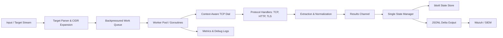

# TcpRecon — System Architecture

This document describes the architecture and evolution of the TcpRecon engine. It explains design goals, engineering problems, architectural solutions, tradeoffs, and implementation decisions across each major phase of development. Use this as a guide for contributors, reviewers, and maintainers.

Table of contents
- [Overview](#overview)
- [High-level architecture](#high-level-architecture)
- [Phases of evolution](#phases-of-evolution)
  - [Phase 1 — Python prototype & threading limitations](#phase-1---python-prototype--threading-limitations)
  - [Phase 2 — Go migration & memory safety](#phase-2---go-migration--memory-safety)
  - [Phase 3 — Application-layer banner grabbing & interface polymorphism](#phase-3---application-layer-banner-grabbing--interface-polymorphism)
  - [Phase 4 — State exhaustion & traffic shaping](#phase-4---state-exhaustion--traffic-shaping)
  - [Phase 5 — Cryptographic extraction & UNIX stream discipline](#phase-5---cryptographic-extraction--unix-stream-discipline)
  - [Phase 6 — Wide-area scaling, ingestion backpressure & stateful edge filtering](#phase-6---wide-area-scaling-ingestion-backpressure--stateful-edge-filtering)
  - [Phase 7 — Deployment, containerization & Kubernetes orchestration](#phase-7---deployment-containerization--kubernetes-orchestration)
  - [SIEM ingestion & pipeline integration](#siem-ingestion--pipeline-integration)
- [Observability, testing & benchmarks](#observability-testing--benchmarks)
- [Configuration & operational guidance](#configuration--operational-guidance)
- [Security, legal & ethics](#security-legal--ethics)
- [Decision log & future work](#decision-log--future-work)

## Overview

TcpRecon is a TCP reconnaissance engine designed to perform precise TCP-level checks, extract application-layer banner and certificate metadata, scale across large target ranges, maintain stateful scan history, and deliver structured telemetry to SIEM infrastructure.

The architecture evolved from a Python prototype into a Go-based concurrent engine, then into a stateful, containerized scanning pipeline capable of scheduled Kubernetes execution and Wazuh ingestion.

The primary goals are:
- Correct TCP port-state detection through full 3-way handshakes.
- Efficient concurrent execution without uncontrolled resource exhaustion.
- Application-layer banner and TLS certificate extraction.
- Stateful delta tracking to suppress redundant SIEM events.
- Low-memory streaming of large target ranges.
- Clean JSONL/NDJSON output for Unix pipelines and SIEM ingestion.
- Safe, repeatable deployment in immutable containers and Kubernetes.

Definitions
- GIL: Global Interpreter Lock (Python)
- C10k: Informal target of handling 10k concurrent connections
- SNI: Server Name Indication (TLS)
- SAN: Subject Alternative Name (TLS)
- IPS: Intrusion Prevention System
- JSONL / NDJSON: JSON Lines / Newline-Delimited JSON
- PVC: PersistentVolumeClaim
- SIEM: Security Information and Event Management

## High-level architecture

A concise view of the main components and data flow:



Component responsibilities
- Target Parser & CIDR Expansion: reads targets through an `io.Reader`, parses inputs line-by-line, and expands CIDRs on demand.
- Backpressured Work Queue: bounds queued work to prevent target generation from overwhelming workers.
- Worker Pool: executes concurrent probes using Goroutines and channels.
- Context-Aware TCP Dial: performs cancellable connections with strict deadlines.
- Protocol Handlers: performs TCP, HTTP, and TLS interactions through reusable `net.Conn` abstractions.
- Extraction & Normalization: extracts banners, certificate metadata, SANs, and structured scan results.
- State Manager: acts as the single writer to the bbolt state store.
- State Store: stores hashes of previous observations for delta detection.
- JSONL Delta Output: emits only new or changed observations.
- SIEM Integration: forwards structured events into Wazuh and downstream OpenSearch pipelines.
- Metrics & Debug Logs: keeps diagnostic output separate from machine-readable telemetry.

## Phases of evolution

Each phase uses the same structured format: Objective → Problem → Solution → Tradeoffs → Implementation notes.

### Phase 1 — Python prototype & threading limitations

- **Objective:** Execute full, concurrent TCP 3-way handshakes to validate port states without relying on pre-packaged binaries such as Nmap.
- **Problem:** The initial Python prototype used `concurrent.futures.ThreadPoolExecutor`. Python's Global Interpreter Lock restricted true parallel execution, while OS-level threads consumed significant memory. Scaling to thousands of concurrent threads caused severe memory usage and CPU context-switching overhead.
- **Problem:** Blindly calling blocking `recv()` immediately after a successful handshake on client-first protocols such as HTTP caused workers to hang while servers waited for a client request. This consumed timeout capacity and stalled scanner throughput.
- **Solution:** The Python implementation served as a proof of concept for validating TCP handshake logic and exposing concurrency and protocol-handling limitations.
- **Tradeoffs:** Python provided fast iteration and simple experimentation but was unsuitable for the desired level of high-concurrency scanning.
- **Implementation notes:** Preserve the prototype and its tests as reference artifacts for regression testing and debugging.

### Phase 2 — Go migration & memory safety

- **Objective:** Achieve high concurrency and horizontal scalability without exhausting memory, file descriptors, or operating-system resources.
- **Problem:** Unbounded concurrency can create race conditions, deadlocks, resource exhaustion, and uncontrolled network pressure.
- **Solution:** Re-implemented the engine in Go using lightweight Goroutines multiplexed over a smaller pool of OS threads. Adopted a strict Worker Pool Pattern using Go channels for task distribution and result collection.
- **Solution:** Used typed channel directions such as `<-chan` and `chan<-` to make data flow explicit and reduce accidental sharing. A dedicated monitor Goroutine managed `sync.WaitGroup` synchronization so the main execution path could consume results without deadlocking.
- **Tradeoffs:** Go provides strong compile-time safety and low per-Goroutine overhead, but channel ownership, cancellation, and lifecycle management require discipline.
- **Implementation notes:**
  - Use `context.Context` for cancellation and deadlines.
  - Avoid unbounded Goroutine creation.
  - Keep shared mutable state minimal.
  - Use channels to define ownership and data flow clearly.
  - Preserve the worker-pool architecture as the primary concurrency boundary.

### Phase 3 — Application-layer banner grabbing & interface polymorphism

- **Objective:** Extract useful application-layer banner data without allowing slow or silent servers to consume workers indefinitely.
- **Problem:** Standard L4 TCP connections cannot extract application data from client-first servers unless the scanner proactively sends a request.
- **Problem:** Go socket operations can block indefinitely by default when deadlines are not configured.
- **Problem:** Passing unvalidated hostnames directly into lower-level socket operations can cause fatal DNS resolution failures and abruptly terminate the process.
- **Solution:** Used Go's `net.Conn` interface as a common abstraction for standard TCP connections and TLS-wrapped connections. This allows protocol handlers to reuse the same read/write logic.
- **Solution:** Injected an HTTP request such as `GET / HTTP/1.1\r\n\r\n` immediately after the TCP handshake to trigger responses from client-first web servers.
- **Solution:** Applied strict `SetDeadline()`, `SetWriteDeadline()`, and `SetReadDeadline()` controls to prevent slow targets from permanently occupying workers.
- **Solution:** Added pre-flight hostname resolution and validation before opening network sockets.
- **Tradeoffs:** Protocol probing becomes more complex than a pure TCP scanner, but the resulting architecture provides significantly more useful reconnaissance data.
- **Implementation notes:**
  - Keep protocol handlers modular.
  - Wrap TLS connections behind the same `net.Conn` abstraction.
  - Ensure all network operations inherit cancellation and deadline behavior.

### Phase 4 — State exhaustion & traffic shaping

- **Objective:** Prevent self-inflicted denial of service, reduce unnecessary network pressure, and guarantee clean process termination.
- **Problem:** Unthrottled concurrency can exhaust local ephemeral ports, saturate NAT state tables, and cause outbound connections to fail with errors such as `ENETUNREACH`.
- **Problem:** Abrupt termination through SIGINT can abandon active connections and leave resources to be cleaned up by the operating system.
- **Problem:** Concurrent workers writing directly to terminal output can interleave messages and corrupt human-readable diagnostics.
- **Solution:** Decoupled concurrency from network throughput using token-bucket rate limiting through `golang.org/x/time/rate`.
- **Solution:** Used `DialContext` and signal handling through `os/signal` and `context.Context` to propagate cancellation through pending network operations.
- **Solution:** Routed debug output through Go's thread-safe `log` package and separated diagnostics from structured stdout output.
- **Tradeoffs:** Rate limiting increases total scan duration, but it improves reliability, reduces resource exhaustion, and makes network behavior controllable.
- **Implementation notes:**
  - Use a conservative global rate limit.
  - Configure burst capacity deliberately.
  - Support graceful cancellation.
  - Keep machine-readable output separate from human-readable diagnostics.

### Phase 5 — Cryptographic extraction & UNIX stream discipline

- **Objective:** Extract hidden virtual-host infrastructure and deliver structured telemetry cleanly to automated pipelines.
- **Problem:** Multi-tenant infrastructure behind edge load balancers can return generic certificates when accessed directly by IP, hiding the actual virtual host identity.
- **Problem:** Human-readable terminal output is difficult to parse reliably in SIEM and Unix pipelines.
- **Solution:** Injected the intended hostname into the TLS `ServerName` field to request the correct virtual-host certificate.
- **Solution:** Parsed `PeerCertificates` and the TLS `ConnectionState` immediately after the handshake to extract certificate metadata and SANs without additional network requests.
- **Solution:** Enforced strict stream separation. Human-readable diagnostics go to `stderr`, while structured JSONL/NDJSON telemetry is emitted exclusively to `stdout`.
- **Tradeoffs:** SNI probing can reveal more infrastructure than a raw IP connection and must therefore be controlled under authorized scanning policies.
- **Implementation notes:**
  - Record the injected SNI alongside observed certificate data.
  - Normalize certificate fields before output.
  - Keep JSON output flat and stable for downstream parsers.
  - Ensure stdout remains safe for direct piping into `jq`, Filebeat, or SIEM ingestion.

### Phase 6 — Wide-area scaling, ingestion backpressure & stateful edge filtering

- **Objective:** Scale across large CIDR blocks while maintaining low memory usage, controlled queue growth, and minimal redundant SIEM telemetry.
- **Problem:** Expanding massive CIDR ranges into in-memory maps or string slices creates heap pressure and can trigger Kubernetes OOMKills.
- **Problem:** A target producer that runs faster than network workers can cause millions of pending jobs to accumulate in memory.
- **Problem:** Writing scan state from thousands of Goroutines creates database mutex contention and disk synchronization bottlenecks.
- **Problem:** Repeatedly reporting unchanged open ports creates SIEM noise and alert fatigue.
- **Solution:** Refactored target ingestion to accept an `io.Reader` and stream targets line-by-line through `bufio.Scanner`.
- **Solution:** Performed CIDR expansion on demand using bitwise operations rather than materializing entire target ranges in memory.
- **Solution:** Applied channel backpressure by bounding the worker queue to approximately `numWorkers * 2`, forcing target generation to pause when workers are saturated.
- **Solution:** Used bbolt as the state store and isolated database access behind a single dedicated State Manager Goroutine.
- **Solution:** Stored `(IP:Port)` state keys and non-cryptographic xxHash values of observed payloads. Matching hashes are discarded immediately; changed observations take the slower write path and generate a JSON delta event.
- **Tradeoffs:** Streaming and stateful processing reduce memory and SIEM noise but introduce checkpointing, persistence, and state-management complexity.
- **Implementation notes:**
  - Use deterministic target iteration.
  - Add persistent cursors for resumable scans.
  - Keep database writes serialized through the State Manager.
  - Treat the hash fast path as an optimization, not a replacement for correct state semantics.

### Phase 7 — Deployment, containerization & Kubernetes orchestration

- **Objective:** Package the scanner into an immutable, minimal container and execute scans safely through Kubernetes scheduling.
- **Problem:** A `scratch` image has no CA certificates, timezone data, or user database, causing HTTPS failures and forcing awkward runtime assumptions.
- **Problem:** bbolt requires an exclusive file lock, so overlapping Pods can collide when accessing the same persistent database.
- **Problem:** An unprivileged UID cannot write to a read-only container root filesystem.
- **Solution:** Used a multi-stage build with a Go Alpine builder, `CGO_ENABLED=0`, pure-Go DNS resolution, and static linking. Copied only the binary and required runtime assets into the final `scratch` image.
- **Solution:** Added an unprivileged user with UID 10001 and copied required `/etc/passwd`, CA certificate, and timezone data.
- **Solution:** Used Kubernetes `concurrencyPolicy: Forbid` to prevent overlapping CronJob executions.
- **Solution:** Used a `ReadWriteOnce` PVC for exclusive state storage.
- **Solution:** Added dynamic database path configuration through `DB_PATH`, routing bbolt storage to the mounted `/data` volume.
- **Tradeoffs:** Minimal containers reduce attack surface but require deliberate dependency management and explicit inclusion of runtime assets.
- **Implementation notes:**
  - Pin builder and application versions.
  - Keep the final image free of unnecessary shells and package managers.
  - Ensure persistent storage permissions match the runtime UID.
  - Treat CronJob concurrency and database locking as a single operational concern.

### SIEM ingestion & pipeline integration

- **Objective:** Securely ingest scanner telemetry, decode events, and generate actionable security alerts in Wazuh.
- **Problem:** Nested JSON structures can be flattened or truncated by decoder behavior, making traditional scanner output difficult to process.
- **Problem:** Wazuh is an active detection engine rather than a passive log forwarder, so malformed or undecoded events may be silently dropped.
- **Problem:** Incorrect APT keyring permissions can prevent unprivileged package verification.
- **Problem:** Filebeat template URLs that return HTML error pages instead of JSON cause template parsing failures.
- **Solution:** Used `tee` to write structured scanner JSON to `/var/log/tcprecon.json` while preserving debug telemetry on `stderr`.
- **Solution:** Created custom Wazuh decoders and rules targeting the `open_port_detected` signature and dynamically mapping fields such as `ip` and `port`.
- **Solution:** Escalated exposed SSH/port 22 events to a Level 10 critical alert.
- **Solution:** Re-imported and dearmored the Wazuh GPG key and explicitly corrected permissions for unprivileged APT verification.
- **Solution:** Pinned the Filebeat template to the exact Wazuh v4.8.0 version and verified successful OpenSearch index mapping.
- **Tradeoffs:** SIEM integration requires strict schema stability and careful decoder/rule design, but provides operational visibility and automated alerting.
- **Implementation notes:**
  - Keep scanner output schema versioned.
  - Test decoder behavior with representative JSONL events.
  - Separate ingestion failures from detection-rule failures.
  - Pin external templates and dependencies where reproducibility matters.

## Observability, testing & benchmarks

Metrics to expose:
- Probes/sec.
- Successful and failed probes.
- Failure reasons.
- Average latency per port.
- Tokens consumed.
- Error rates.
- Goroutine count.
- Open file descriptors.
- Queue depth and backpressure events.
- State-store reads, writes, and hash matches.
- Number of emitted deltas versus suppressed duplicates.

Logging:
- Structured logs with trace or probe identifiers.
- Human-readable diagnostics on `stderr`.
- Machine-readable scan results on `stdout`.

Tests:
- Unit tests for target parsing and CIDR expansion.
- Unit tests for protocol handlers.
- Tests for TLS certificate and SAN extraction.
- Tests for hash-based state comparison.
- Integration tests using local HTTP and TLS test servers.
- Cancellation and deadline tests.
- Wazuh decoder and rule validation tests.

Benchmarks:
- Targets/sec against rate-limit settings.
- Memory usage during large CIDR scans.
- Queue behavior under producer/consumer imbalance.
- bbolt read/write performance.
- State deduplication efficiency.
- End-to-end scanner-to-SIEM ingestion latency.

CI:
- Run deterministic unit tests on every change.
- Keep heavy network integration tests optional or gated.
- Include static analysis, race detection, and container image validation.

## Configuration & operational guidance

Default configuration values:
- Rate limit: conservative deployment-specific default.
- Burst capacity: deliberately bounded to prevent traffic spikes.
- Connection timeout: strict and configurable.
- Read/write deadline: shorter than the overall connection timeout.
- Worker count: sized according to available CPU, file descriptors, and network capacity.
- Queue size: approximately `numWorkers * 2` unless workload testing justifies another value.
- Database path: configurable through `DB_PATH`.

Runtime flags and environment:
- `--targets`
- `--ports`
- `--rate`
- `--output-format`
- `--resume-checkpoint`
- `DB_PATH`

Example execution:

```bash
tcprecon --targets targets.txt --ports 22,80,443 --rate 50 --output ndjson
```

Example pipeline:

```bash
tcprecon --targets targets.txt --ports 22,80,443 --output ndjson 2>debug.log   | tee /var/log/tcprecon.json
```

Recommended runtime considerations:
- Configure file-descriptor limits according to expected concurrency.
- Ensure the state database resides on persistent storage when running in Kubernetes.
- Ensure the runtime UID has write access to the mounted state directory.
- Avoid overlapping scans against the same bbolt database.
- Monitor queue depth, open connections, and state-store latency.

## Security, legal & ethics

- Scanning networks and hosts without authorization may be illegal or violate provider policies.
- Obtain permission before scanning infrastructure that you do not own or administer.
- SNI injection and certificate querying can still be considered intrusive depending on the environment.
- Rate limiting should be used to reduce unnecessary network impact, not as a mechanism for unauthorized activity.
- SIEM integrations must protect credentials, logs, and persistent state.
- Follow responsible disclosure procedures when authorized testing identifies security issues.

## Decision log & future work

Maintain a `CHANGELOG` or `DECISIONS.md` documenting:
- Why the Python prototype was replaced.
- Why Go and the Worker Pool Pattern were selected.
- Why strict deadlines and context cancellation were introduced.
- Why SNI injection was adopted.
- Why streaming ingestion and channel backpressure were required.
- Why bbolt and a single State Manager were selected.
- Why delta hashing was introduced to reduce SIEM noise.
- Why scratch-based deployment and Kubernetes `Forbid` scheduling were adopted.
- Why Wazuh decoder/rule customization was required.

Future work:
- Resumable scans with persistent checkpoints.
- Distributed scanning coordination with secure authentication.
- Pluggable output connectors for Kafka, S3, and Elastic.
- Advanced TLS protocol heuristics such as ALPN parsing.
- HTTP/2 probing.
- Improved state compaction and retention policies.
- Distributed state management for multi-node scanning.
- More advanced Wazuh enrichment and correlation rules.
