# TcpRecon System Architecture

## 1. Purpose and scope

TcpRecon is a network attack-surface monitoring platform built around a custom Go scanner. It continuously observes authorized network scopes, records service metadata, compares observations with a persistent baseline, and emits atomic security events for SIEM detection and analytics.

The project is not intended to outperform or replace mature scanners. Its engineering objective is to demonstrate a complete and reproducible pipeline:

```text
network observation → normalized state → lifecycle event → detection → analysis → remediation evidence
```

## 2. Design principles

1. **Correctness before scale.** Input parsing, cancellation, state classification, and event semantics must be trustworthy before throughput is optimized.
2. **Bounded concurrency.** Worker pools and bounded channels prevent unbounded goroutine and memory growth.
3. **Controlled network impact.** A global rate limiter controls probe starts independently of concurrency.
4. **Atomic telemetry.** Each NDJSON line contains one observation or lifecycle event.
5. **Single ownership of persistent state.** A dedicated goroutine serializes bbolt writes.
6. **No false remediation.** Partial or cancelled scans cannot replace a complete baseline.
7. **Reproducible operations.** Wazuh rules, fixtures, mappings, dashboards, and deployment instructions belong in Git.
8. **Honest claims.** Performance and reliability claims require tests and published evidence.

## 3. System context

```mermaid
flowchart LR
  Scope[Authorized target scope] --> Input[Input source selection]
  Input --> Parser[Streaming target and port parser]
  Parser --> Queue[Bounded work queues]
  Queue --> TCP[TCP worker pool]
  Queue --> UDP[Selected UDP worker pool]
  TCP --> Protocols[HTTP and TLS handlers]
  UDP --> Protocols
  Protocols --> Normalize[Observation normalization]
  Normalize --> Results[Results channel]
  Results --> State[Single state-manager goroutine]
  State <--> Bolt[(bbolt state database)]
  State --> Events[Versioned NDJSON events]
  Events --> Wazuh[Wazuh manager]
  Wazuh --> Indexer[Wazuh Indexer / OpenSearch]
  Indexer --> Dashboard[Dashboards and remediation analytics]
  TCP -. diagnostics .-> Stderr[stderr]
  UDP -. diagnostics .-> Stderr
```



## 4. Major components

### 4.1 Input source selection

Target input may originate from a positional target, local file, standard input, or an authorized remote list. Input-source selection must be explicit and mutually unambiguous.

Required behavior:

- reject multiple conflicting sources;
- reject excessive positional arguments;
- validate URLs before network fetching;
- resolve hostnames without terminating the whole process on one failure;
- preserve target identity alongside resolved addresses;
- stream large sources instead of loading them completely into memory.

### 4.2 Streaming parser

The parser reads through `io.Reader` and produces normalized scan jobs. CIDR expansion should occur incrementally so producer memory remains bounded.

The parser is subject to backpressure. When work queues fill, parsing pauses until workers consume jobs. This prevents a fast producer from manufacturing millions of queued objects that contribute nothing except an eventual meeting with the OOM killer.

### 4.3 Dispatcher and worker pools

The dispatcher routes jobs to protocol-specific worker pools.

- TCP workers use full-connect scanning through cancellable dials.
- UDP workers send selected protocol-aware payloads and classify replies conservatively.
- Channel direction types document ownership and prevent accidental misuse.
- `sync.WaitGroup` and channel-closure ownership are centralized.
- Worker counts are validated and bounded.

Concurrency controls the number of simultaneous operations. The rate limiter controls how quickly new probes begin. These are separate dimensions.

### 4.4 Network operations

All socket operations require deadlines and context cancellation.

TCP results distinguish stable states from operational errors:

- successful connection: `open`;
- connection refused: generally `closed`;
- timeout or no response: `unknown` or a carefully defined timeout state;
- unreachable network, DNS failure, and cancellation: scanner or target-resolution errors.

A timeout alone must not be presented as proof of firewall filtering.

UDP classification is protocol-dependent and more uncertain. Positive application responses are stronger evidence than silence.

### 4.5 Protocol metadata

HTTP handlers may send a bounded request to client-first services. TLS handlers may use SNI when a hostname is available and collect:

- certificate subject and issuer;
- SANs;
- negotiated TLS version;
- cipher suite;
- validity period;
- verification result.

Reads and banners must be size-limited. Raw server content is untrusted input and must not be allowed to produce unbounded events.

### 4.6 Observation normalization

Internal worker structures are not serialized directly. A dedicated event model isolates the public telemetry contract from implementation details.

Stable comparison inputs may include:

- protocol;
- normalized IP address;
- port;
- service state;
- normalized service name;
- bounded normalized banner;
- certificate fingerprint or stable certificate fields.

Unstable fields must not influence state hashes:

- scan timestamp;
- latency;
- event ID;
- temporary OS error text;
- worker or rate settings.

### 4.7 State manager and bbolt

Workers never write directly to bbolt. They send normalized observations to a single state-manager goroutine.

The database requires a versioned schema with metadata such as:

```text
metadata/schema_version
metadata/created_at
scope/<scope_id>/baseline/...
scope/<scope_id>/scan/<scan_id>/...
finding/<finding_id>/...
```

State keys include protocol, address, and port. TCP and UDP observations for the same numbered port are separate services.

## 5. Lifecycle reconciliation

Hash suppression alone detects first-seen or changed open observations, but cannot reliably detect service closure. Complete lifecycle tracking compares a finished scan with the previous committed baseline.

```text
current - previous                         = opened
current ∩ previous with different hash    = changed
previous - current                         = closed
previously closed and observed again       = reopened
```

### 5.1 Commit rule

A scan baseline may be committed only when:

- all intended target and port jobs were produced;
- worker processing completed;
- the process was not cancelled;
- no fatal parser or state error made the scan incomplete.

Temporary observations are discarded after incomplete scans. This invariant prevents a network outage or Ctrl+C from being celebrated as successful remediation.

### 5.2 Stable identifiers

- `scan_id`: unique to one execution;
- `scope_id`: stable hash of normalized targets, ports, and protocols;
- `finding_id`: stable identity of a service finding within a scope;
- `event.id`: unique lifecycle event identifier.

Worker count, rate limit, timeout, timestamps, and duration do not belong in `scope_id`.

## 6. Event pipeline

TcpRecon emits one versioned NDJSON object per event.

```text
stdout → events only
stderr → diagnostics only
```

The lifecycle vocabulary is:

- `service.opened`
- `service.changed`
- `service.closed`
- `service.reopened`
- optional operational events such as `scan.failed`

The canonical schema is defined in [`docs/EVENT_SCHEMA.md`](./docs/EVENT_SCHEMA.md).

## 7. Wazuh integration

Wazuh reads the event file using a JSON `<localfile>` configuration. Repository-owned integration assets should be arranged as:

```text
deployments/wazuh/
├── README.md
├── config/
│   └── tcprecon-localfile.xml
├── rules/
│   └── tcprecon_rules.xml
├── fixtures/
│   ├── service-opened.ndjson
│   ├── service-changed.ndjson
│   ├── service-closed.ndjson
│   └── deprecated-tls.ndjson
└── scripts/
    ├── install-rules.sh
    └── uninstall-rules.sh
```

Rule design should separate:

1. base event recognition;
2. lifecycle classification;
3. policy violations;
4. asset context;
5. risk escalation.

An open SSH port is not automatically a critical incident. Severity depends on whether the service is approved, exposed, vulnerable, newly introduced, or located on a critical asset.

Every fixture must be tested with `wazuh-logtest` before manager restart.

## 8. OpenSearch analytics

Dashboard-critical fields require explicit mappings:

| Field type | Mapping |
|---|---|
| IP address | `ip` |
| port, risk score | numeric |
| timestamps | `date` |
| event type, severity, reason code | `keyword` |
| owner, environment, criticality | `keyword` |
| explanations and long banners | `text` plus bounded keyword fields only where justified |

Numeric fields already support disk-backed aggregations. They should not be forced into `.keyword` mappings. FieldData should not be enabled merely to make an analyzed text field aggregate.

Planned dashboards include current exposure, service changes, unresolved risk, deprecated TLS, certificate expiry, and remediation duration.

## 9. Deployment architecture

### 9.1 Container

The container uses a multi-stage build and a minimal runtime:

- static Go binary;
- no shell or package manager;
- CA certificates and timezone data copied explicitly;
- unprivileged UID;
- read-only root filesystem where possible;
- all Linux capabilities dropped.

### 9.2 Kubernetes

Scheduled execution uses a CronJob with:

- `concurrencyPolicy: Forbid`;
- a `ReadWriteOnce` persistent volume for bbolt;
- `DB_PATH` directed into the writable mount;
- resource requests sized for the lab;
- bounded scan scope and frequency.

bbolt's exclusive file lock makes overlapping writers invalid by design, not merely inconvenient.

### 9.3 Wazuh lab baseline

The current lab baseline is a dedicated Ubuntu Server 24.04 LTS host with constrained hardware. The deployment should remain small, use short retention, and avoid enabling expensive workloads until the core manager, indexer, dashboard, and Filebeat services are stable.

Version-specific installation instructions belong in deployment documentation because supported versions change. Architecture should describe invariants, not fossilize one afternoon's package versions.

## 10. CI/CD and GitOps

Pull requests and pushes should run:

```bash
gofmt verification
go vet ./...
go test ./...
go test -race ./...
go build ./cmd/tcprecon
```

Release automation may build and publish immutable OCI images to GHCR. Production hosts pull versioned images and do not compile or edit source code directly.

Generated binaries, credentials, local state databases, certificates, and password archives must not be committed.

## 11. Security boundaries

- The scanner operates only within explicit authorized scope.
- Remote target lists are untrusted input and require HTTPS, size limits, timeouts, and validation.
- Banners and certificate fields are untrusted and must be bounded before logging.
- Secrets for GHCR, Wazuh, Slack, or other integrations remain outside Git.
- Rate limiting protects local and target resources; it is not an evasion mechanism.
- Telemetry integrity matters because malformed or mixed stdout can corrupt downstream detection.

## 12. Verification strategy

### Unit tests

- port and protocol parsing;
- target and input-source parsing;
- CIDR iteration;
- state-key construction;
- normalized hashing;
- event serialization;
- lifecycle-set reconciliation;
- risk-score boundaries.

### Local integration tests

- loopback TCP listener;
- closed local port;
- local HTTP test server;
- local TLS test server;
- selected UDP responders;
- deadline and cancellation behavior;
- stdout/stderr separation;
- database restart and migration behavior.

### End-to-end lab test

1. Start an authorized lab service.
2. Complete a scan and emit `service.opened`.
3. Repeat the scan and emit no duplicate lifecycle event.
4. Change the service and emit `service.changed`.
5. Stop the service and emit `service.closed`.
6. Restart it and emit `service.reopened`.
7. Confirm Wazuh decoding and expected rule matches.
8. Confirm OpenSearch fields and dashboard visibility.

## 13. Deliberate non-goals

Until the vertical slice is complete, the project will not prioritize:

- distributed scanner coordination;
- Kafka or large streaming platforms;
- broad vulnerability detection;
- Internet-wide scanning;
- complex multi-tenant dashboards;
- claims of C10k, million-socket, or fixed per-worker memory performance without reproducible benchmarks.

## 14. Historical evolution

The project began as a Python `socket` prototype, moved to Go worker pools, added application-layer and TLS metadata, introduced rate limiting and cancellation, separated telemetry from diagnostics, adopted bbolt-based state suppression, and expanded into container, Kubernetes, Wazuh, and OpenSearch workflows.

Those milestones explain the design, but historical implementation anecdotes do not override the current contracts documented here.
