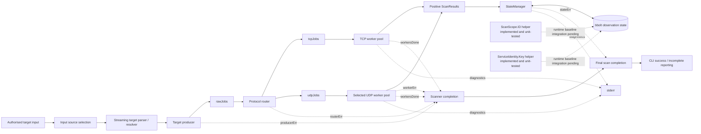
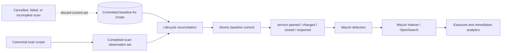

# TcpRecon System Architecture

> **Document status:** This document separates verified current behaviour from target architecture. A component is described as **implemented** only when it exists on the active branch and has supporting verification. **Planned** sections describe the intended vertical slice and must not be read as current runtime behaviour.

## 1. Purpose and scope

TcpRecon is a Go-based authorised network-observation engine. It performs TCP full-connect reconnaissance and selected UDP probes, collects service metadata, and stores positive observations in bbolt. Repeated executions are intended to support attack-surface monitoring, but complete service lifecycle reconciliation is still under development.

The project is not intended to outperform or replace mature scanners. Its engineering objective is to demonstrate a complete and reproducible pipeline:

```text
network observation → normalized state → lifecycle event → detection → analysis → remediation evidence
```

The scanner, stable identity helpers, explicit scan-completion boundary, and observation-state foundations exist. Lifecycle reconciliation, stable baseline promotion, lifecycle events, Wazuh detection, and OpenSearch remediation analytics remain later parts of the vertical slice unless a section explicitly states otherwise.

## 2. Design principles

1. **Correctness before scale.** Input parsing, cancellation, state classification, and event semantics must be trustworthy before throughput is optimized.
2. **Bounded concurrency.** Worker pools and bounded channels prevent unbounded goroutine and memory growth.
3. **Controlled network impact.** A global rate limiter controls probe starts independently of concurrency.
4. **Atomic telemetry.** Each NDJSON line contains one observation or lifecycle event.
5. **Single ownership of persistent state.** A dedicated goroutine serializes bbolt writes.
6. **No false remediation.** Partial or cancelled scans cannot replace a complete baseline.
7. **Reproducible operations.** Wazuh rules, fixtures, mappings, dashboards, and deployment instructions belong in Git.
8. **Honest claims.** Performance and reliability claims require tests and published evidence.

## 3. System context

### 3.1 Current scanner pipeline

**Status: implemented, with lifecycle reconciliation still pending.**



Verified Phase B completion behaviour:

- `scanner.Run` exposes the result stream and a separate asynchronous `ScanCompletion` channel;
- result-channel closure proves result production has ended, but does not by itself prove scan success;
- producer errors distinguish cancellation, target parse failure, and target-resolution failure;
- router cancellation is propagated rather than discarded;
- worker-level failure can make the scan incomplete when intended work cannot be executed;
- `StateManager` returns persistence failure instead of only logging it;
- the CLI combines scanner completion with the state-manager outcome before reporting success;
- `ScanCompletion.Successful()` is true only for `completed` with no error.

Current limitations relevant to Phase B:

- workers still emit positive observations only;
- the existing bbolt observation state is not yet the versioned committed-baseline model required for lifecycle reconciliation;
- `scope_id` and `service_key` helpers remain isolated from durable baseline partitioning;
- B5 provides the commit-authorization signal, but B6 must still implement temporary current-scan state, reconciliation, and atomic baseline promotion;
- UDP blocking reads remain deadline-bound and may not react immediately to cancellation.

### 3.2 Target lifecycle vertical slice

**Status: planned.**



A cancelled, failed, partial, or unresolved scan must preserve the previous committed baseline and must not generate `service.closed`.

## 3.3 Phase B implementation progress

Phase B is being built incrementally so identity and lifecycle rules are verified before they are connected to persistent reconciliation.

| Workstream | Result | Status |
|---|---|---|
| **B1: Trace current data flow** | Traced CLI input, target parsing/resolution, dispatch, TCP/UDP workers, results channel, state manager, bbolt updates, and current output. Confirmed that positive-only observations and channel closure are insufficient to prove a successful complete scan. | Complete analysis |
| **B2: Define lifecycle and identity contracts** | Defined `service.opened`, `service.changed`, `service.closed`, `service.reopened`, temporary current-scan state, committed baseline semantics, and the successful-scan commit rule. The original `finding_id` proposal was later deferred during B4. | Complete on paper |
| **B3: Stable scan-scope identity** | Implemented and unit-tested deterministic `ScanScope.ID()` from canonical targets plus separate TCP/UDP port sets. | Implemented and verified in isolation |
| **B4: Stable service identity** | Implemented and unit-tested deterministic `ServiceIdentity.Key()` from `scope_id`, canonical IP, port, and protocol. | Implemented and verified in isolation |
| **B5: Explicit scan completion** | Implemented `ScanCompletion`, explicit failure statuses, producer/router/worker outcome propagation, sticky state-manager failure reporting, asynchronous completion from `Run`, and final CLI success gating. | Implemented and verified |

The active Phase B identity chain is now:

```text
scope_id -> service_key -> event_id
```

`finding_id` is deliberately deferred. It will be introduced only if one service can own multiple independent security findings rather than one lifecycle history.

B5 now provides the trustworthy scan-level success/failure boundary required before absence can be used as lifecycle evidence. Neither B3 nor B4 is yet connected to runtime reconciliation or bbolt baseline promotion. B6 is the next safety boundary: versioned state, temporary current-scan observations, same-scope reconciliation, and atomic baseline promotion gated by B5.

## 4. Major components

### 4.1 Input source selection

Target input may originate from a positional target, local file, standard input, or an authorised remote list. Input-source selection must be explicit and mutually unambiguous.

Required behaviour:

- reject multiple conflicting sources;
- reject excessive positional arguments;
- validate URLs before network fetching;
- resolve hostnames without terminating the whole process on one failure;
- preserve target identity alongside resolved addresses;
- stream large sources instead of loading them completely into memory.

### 4.2 Streaming parser

The parser reads through `io.Reader` and produces scan jobs. Large individual CIDRs should eventually be expanded incrementally so producer memory remains bounded.

The parser is subject to backpressure. When work queues fill, parsing pauses until workers consume jobs.

B5 changed target production from a fire-and-forget operation into an explicit producer outcome. `StreamTargets` now returns an error and preserves these scan-level conditions:

- context cancellation;
- target parse/job-production failure;
- target-resolution failure;
- underlying input-reader failure, classified under the parse/production boundary;
- `nil` when target production completes successfully.

Target parse or resolution failure does not necessarily stop all remaining valid work. The producer may continue scanning valid targets while retaining the first failure so the overall scan is still classified as incomplete. Cancellation is propagated immediately.

The producer-side send path checks `ctx.Err()` before a context-aware channel send. This avoids a race where an already-cancelled context and an available buffered send are both ready and Go's `select` would otherwise be free to choose the send.

### 4.3 Dispatcher and worker pools

The dispatcher routes jobs to protocol-specific worker pools.

- TCP workers use full-connect scanning through context-aware dials.
- UDP workers send selected protocol-aware payloads and classify positive replies conservatively.
- Channel direction types document ownership and prevent accidental misuse.
- `sync.WaitGroup` and channel-closure ownership are centralised.
- Worker counts are validated and bounded.

B5 makes asynchronous stage outcomes explicit:

- `startTargetProducer` owns `rawJobs` closure and publishes one producer error result;
- `startJobRouter` owns `tcpJobs` and `udpJobs` closure and publishes one router error result;
- worker completion is signalled separately from result-channel closure;
- worker failures are captured without blocking error-reporting goroutines;
- `startScannerCompletion` combines producer, router, worker, context, and worker-termination evidence into one scanner-level completion result.

Unsupported UDP work is no longer silently skipped. If an intended UDP port has no supported payload, the UDP worker records a worker-level failure, continues draining queued jobs so the router cannot be stranded, and returns the retained error when its job channel closes.

Ordinary probe failures remain per-service outcomes rather than scan-level worker failures. TCP connection failures, TLS/banner failures, UDP silence, and similar network conditions do not automatically produce `worker_failed`.

Concurrency controls the number of simultaneous operations. The rate limiter controls how quickly new probes begin. These are separate dimensions.

### 4.4 Network operations

Socket operations require deadlines. TCP dials use the shared context. UDP cancellation still needs explicit review because the current UDP read path is deadline-bound rather than directly context-aware. B5 ensures an eventual cancellation is not reported as successful completion, but cancellation responsiveness can still be delayed until the UDP deadline expires.

TCP observations distinguish established connections from operational failure. A timeout alone must not be presented as proof of firewall filtering or service closure.

UDP classification is protocol-dependent and more uncertain. Positive application responses are stronger evidence than silence.

### 4.5 Protocol metadata

HTTP handlers may send a bounded request to client-first services. TLS handlers may use SNI when a hostname is available and collect available certificate metadata.

Current metadata support and later enrichment must remain distinct. Negotiated TLS version, cipher suite, validity period, and verification result belong to later verified work unless supported by tests on the active branch.

Reads and banners must be size-limited. Raw server content is untrusted input and must not produce unbounded events.

### 4.6 Observation normalization

Internal worker structures should not become the long-term public telemetry contract. A dedicated event model will isolate lifecycle events from implementation details.

Stable comparison inputs may include:

- protocol;
- normalized IP address;
- port;
- service state;
- normalized service name;
- bounded normalized banner;
- certificate fingerprint or selected stable certificate fields.

Unstable fields must not influence observation fingerprints:

- scan timestamp;
- latency;
- event ID;
- temporary OS error text;
- worker, rate, or timeout settings.

### 4.7 Stable scan-scope identity

**Status: implemented and unit-tested in isolation; runtime integration pending.**

`internal/scanner/scope.go` defines `ScanScope` and derives a deterministic ID from a versioned canonical representation containing:

- normalized target definitions;
- a deduplicated and sorted TCP port set;
- a deduplicated and sorted UDP port set.

Separate TCP and UDP port lists encode the protocol dimension, so TCP port 53 and UDP port 53 produce different scope identities.

Target canonicalization currently:

- trims surrounding whitespace;
- lowercases hostnames and removes a trailing dot;
- masks CIDRs to their network prefix;
- canonicalizes IPv4 and IPv6 text through `net/netip`;
- unmapped IPv4-mapped IPv6 addresses to their IPv4 form.

The canonical value is serialized as JSON and hashed with SHA-256. The schema version is included in the canonical value so future identity changes can be explicit rather than silently reinterpreting prior IDs.

The following execution settings are intentionally excluded:

- worker count;
- rate limit;
- timeout;
- timestamps;
- scan duration;
- scan ID.

Canonicalization builds new slices before sorting, so `ID()` does not mutate caller-owned target or port slices.

Verified tests cover:

- reordered and duplicated equivalent inputs producing the same ID;
- changed targets producing a different ID;
- changed TCP or UDP port sets producing a different ID;
- TCP and UDP separation;
- execution settings not affecting identity;
- hostname, CIDR, IPv6, and whitespace normalization;
- absence of caller-slice mutation.

Current limitation: the CLI does not yet preserve and pass a canonical `ScanScope` into scanner execution or bbolt state. The helper therefore cannot yet prevent cross-scope reconciliation mistakes at runtime.

### 4.8 Stable service identity

**Status: implemented and unit-tested in isolation; runtime and persistence integration pending.**

`internal/scanner/service_identity.go` defines `ServiceIdentity` with exactly four identity inputs:

- `scope_id`;
- IP address;
- port;
- protocol.

The service key answers: **which network service within this stable scan scope is being observed?** A target may therefore own multiple service keys, for example TCP/22, TCP/443, and UDP/53.

The identity rules are:

- `scope_id` must not be empty;
- IP text must parse with `netip.ParseAddr`;
- equivalent IPv6 forms are canonicalized through `netip.Addr.String()`;
- IPv4-mapped IPv6 is unmapped so `::ffff:192.0.2.10` and `192.0.2.10` share an identity;
- protocol must already be canonical and exactly `tcp` or `udp`;
- port must be within `1..65535`.

The canonical representation is versioned, serialized as JSON, hashed with SHA-256, and encoded as lowercase hexadecimal.

The following values are deliberately excluded from service identity:

- target hostname or display name;
- banner and service metadata;
- TLS metadata;
- service state;
- scan ID;
- timestamps and latency;
- worker, rate, and timeout settings.

Verified tests cover:

- identical service input producing the same key;
- different IP, port, protocol, or scope producing different keys;
- TCP and UDP separation on the same numbered port;
- equivalent IPv6 representations;
- IPv4-mapped IPv6 equivalence;
- invalid IP rejection;
- strict `tcp`/`udp` protocol validation;
- invalid port rejection and valid boundary acceptance;
- empty scope-ID rejection.

A fixed known-vector compatibility test is intentionally deferred until `service_key` becomes persisted state. At that boundary, the exact v1 derivation must be frozen or migrated explicitly so a serialization refactor cannot manufacture false `closed` and `opened` transitions.

Current limitation: `ServiceIdentity.Key()` is not yet attached to `ScanResult`, the temporary current-scan observation set, reconciliation, or bbolt keys.

### 4.9 Explicit scan completion

**Status: implemented and verified.**

B1 established that result-channel closure only proves that result-producing workers exited. B5 therefore introduced a separate scan-level completion result before lifecycle reconciliation is allowed to treat missing observations as evidence.

The core model is:

```go
type ScanCompletion struct {
    Status ScanStatus
    Err    error
}
```

`Successful()` is intentionally strict:

```text
Status == completed
AND
Err == nil
```

Current status vocabulary:

- `completed`;
- `cancelled`;
- `resolution_failed`;
- `parse_failed`;
- `worker_failed`;
- `state_failed`.

The scanner-side completion path combines:

```text
producer outcome
+ router outcome
+ worker outcome
+ worker termination
+ context state
= scanner completion
```

`scanner.Run` returns both the observation stream and an asynchronous completion channel. The completion path does not block normal result consumption.

The CLI then combines scanner completion with `StateManager` persistence outcome:

```text
scanner completion + stateErr = final scan completion
```

Rules:

- scanner success + state success -> `completed`;
- scanner success + state failure -> `state_failed`;
- scanner failure + state success -> preserve scanner failure;
- scanner failure + state failure -> preserve the scanner status and retain both diagnostic errors;
- missing or internally inconsistent completion evidence fails closed.

Cancellation remains authoritative over worker errors caused by the same cancelled context. Producer parse and resolution errors retain their specific classifications. A worker failure is used only when intended work cannot be completed, not for ordinary network-probe failure.

B5 verification includes focused tests, 100 repeated completion/worker test runs, race-enabled scanner and CLI tests, `go vet ./...`, `git diff --check`, and the full repository test suite.

B5 provides the authorization signal for baseline promotion. It does not itself implement lifecycle baseline replacement. B6 must require `ScanCompletion.Successful() == true` before a temporary current-scan observation set can become the committed baseline.

### 4.10 State manager and bbolt

**Current status: positive-observation hashing exists; persistence failure is now explicit; complete lifecycle storage is planned for B6.**

Workers do not write directly to bbolt. They send scan results to `StateManager`, which serializes persistence work.

B5 changed the state-manager boundary from an open-port count only to an explicit persistence outcome:

```text
StateManager(...) -> (openPorts, stateErr)
```

Persistence-error behaviour is deliberately sticky:

1. the first bbolt update failure is retained;
2. subsequent state writes are skipped for that run;
3. `StateManager` continues draining the results channel;
4. when the result stream closes, it returns the accumulated open-port count and retained error.

Continuing to drain results after persistence failure is a concurrency-safety requirement. Returning immediately could leave scanner workers blocked while sending into `results`, preventing their `WaitGroup` from completing and preventing scan completion from resolving.

The existing bbolt layout is still observation-oriented and is not yet the durable lifecycle schema. B6 requires explicit metadata and scoped state such as:

```text
metadata/schema_version
metadata/created_at
scope/<scope_id>/baseline/<service_key>/...
scope/<scope_id>/scan/<scan_id>/<service_key>/...
```

Baseline and temporary current-scan records will be keyed by stable `service_key` within `scope_id`. TCP and UDP observations for the same numbered port are separate services.

## 5. Lifecycle reconciliation

**Status: contract defined; implementation pending.**

Hash suppression alone detects first-seen or changed positive observations, but cannot reliably detect service closure. Complete lifecycle tracking compares a successfully finished scan with the previous committed baseline for the same scope.

```text
current - previous                         = opened
current ∩ previous with different hash    = changed
previous - current                         = closed
previously closed and observed again       = reopened
```

### 5.1 Commit rule

B5 now implements the authorization signal for baseline promotion. B6 must treat this as a hard gate:

```text
ScanCompletion.Successful() == true  -> baseline promotion may proceed
ScanCompletion.Successful() == false -> baseline promotion forbidden
```

A scan can be successful only when:

- target production completed without an incomplete-scope parse or resolution failure;
- routing completed;
- intended worker processing completed without a scan-level worker failure;
- the process was not cancelled;
- state persistence completed without error.

B5 does not yet perform the durable baseline commit. B6 owns the temporary current-scan set, same-scope reconciliation, and atomic replacement of the committed baseline.

Temporary observations from incomplete scans must be discarded rather than promoted. This prevents outages, parser/resolution failures, worker failures, persistence failures, or Ctrl+C from being reported as successful remediation.

### 5.2 Stable identifiers

| Identifier | Contract | Current status |
|---|---|---|
| `scan_id` | Unique to one execution | Planned |
| `scope_id` | Stable hash of canonical targets plus separate TCP and UDP port sets | Helper implemented and tested; runtime integration pending |
| `service_key` | Stable identity of one service within a scope: canonical IP + port + protocol under `scope_id` | Helper implemented and tested; runtime integration pending |
| `event_id` | Unique identity of one lifecycle event | Planned |
| `finding_id` | Separate security-finding identity | Deferred until one service can own multiple independent findings |

The active Phase B identity chain is `scope_id -> service_key -> event_id`. Worker count, rate limit, timeout, timestamps, duration, banners, TLS metadata, and service state do not belong in stable service identity.

## 6. Event pipeline

**Current status:** TcpRecon can emit machine-readable observation or delta records while diagnostics belong on stderr.

**Target status:** TcpRecon emits one versioned NDJSON object per lifecycle or operational event.

```text
stdout → telemetry only
stderr → diagnostics only
```

The planned lifecycle vocabulary is:

- `service.opened`
- `service.changed`
- `service.closed`
- `service.reopened`
- optional operational events such as `scan.failed`

The canonical lifecycle schema will be documented in `docs/EVENT_SCHEMA.md` when its fields and semantics are implemented and verified.

## 7. Wazuh integration

**Status: planned and dependent on verified lifecycle events.**

Wazuh will read the event file using a JSON `<localfile>` configuration. Repository-owned integration assets should be arranged as:

```text
deployments/wazuh/
├── README.md
├── config/
│   └── tcprecon-localfile.xml
├── rules/
│   └── tcprecon_rules.xml
├── fixtures/
│   ├── service-opened.ndjson
│   ├── service-changed.ndjson
│   ├── service-closed.ndjson
│   └── deprecated-tls.ndjson
└── scripts/
    ├── install-rules.sh
    └── uninstall-rules.sh
```

Rule design should separate:

1. base event recognition;
2. lifecycle classification;
3. policy violations;
4. asset context;
5. risk escalation.

An open SSH port is not automatically a critical incident. Severity depends on context such as approval, exposure, vulnerability, change status, and asset criticality.

Every fixture must be tested with `wazuh-logtest` before manager restart.

## 8. OpenSearch analytics

**Status: planned and dependent on reproducible Wazuh ingestion.**

Dashboard-critical fields require explicit mappings:

| Field type | Mapping |
|---|---|
| IP address | `ip` |
| port, risk score | numeric |
| timestamps | `date` |
| event type, severity, reason code | `keyword` |
| owner, environment, criticality | `keyword` |
| explanations and long banners | `text` plus bounded keyword fields only where justified |

Numeric fields should not be forced into `.keyword` mappings. FieldData should not be enabled merely to aggregate analyzed text.

Planned dashboards include current exposure, service changes, unresolved risk, deprecated TLS, certificate expiry, and remediation duration.

## 9. Deployment architecture

### 9.1 Container

**Status: repository baseline exists; current runtime verification should be recorded separately.**

The intended container uses a multi-stage build and a minimal runtime:

- static Go binary;
- no shell or package manager;
- CA certificates and timezone data copied explicitly;
- unprivileged UID;
- read-only root filesystem where possible;
- all Linux capabilities dropped.

### 9.2 Kubernetes

**Status: repository baseline exists; lifecycle safety is not complete.**

Scheduled execution uses a CronJob with:

- `concurrencyPolicy: Forbid`;
- a `ReadWriteOnce` persistent volume for bbolt;
- `DB_PATH` directed into the writable mount;
- resource requests sized for the lab;
- bounded scan scope and frequency.

bbolt's exclusive file lock makes overlapping writers invalid by design.

### 9.3 Wazuh lab baseline

**Status: deployment target, not evidence that the stack is currently running.**

The planned lab baseline is a dedicated Ubuntu Server 24.04 LTS host with constrained hardware. Deployment status, package versions, and installation commands belong in operations or status documentation because they change independently of scanner architecture.

## 10. CI/CD and GitOps

Pull requests and pushes should verify:

```bash
gofmt verification
go vet ./...
go test ./...
go test -race ./...
go build ./cmd/tcprecon
```

Release automation may build immutable OCI images. Generated binaries, credentials, local state databases, certificates, and password archives must not be committed.

## 11. Security boundaries

- The scanner operates only within explicit authorised scope.
- Remote target lists are untrusted input and require HTTPS, size limits, timeouts, and validation.
- Banners and certificate fields are untrusted and must be bounded before logging.
- Secrets for registries, Wazuh, Slack, or other integrations remain outside Git.
- Rate limiting protects local and target resources; it is not an evasion mechanism.
- Telemetry integrity matters because mixed stdout can corrupt downstream detection.

## 12. Verification strategy

### 12.1 Verified identity foundations

B3 scope identity:

```bash
go test -count=1 ./internal/scanner -run ScanScope
```

B4 service identity:

```bash
go test -count=1 ./internal/scanner -run 'TestServiceIdentityKey'
```

Package verification used for both checkpoints:

```bash
go test -count=1 ./internal/scanner
go test -race -count=1 ./internal/scanner
go vet ./internal/scanner
git diff --check
```

These checks verify deterministic scope identity, deterministic service identity, IP canonicalization, TCP/UDP separation, validation behavior, and absence of scope-input mutation. They do not prove runtime integration, persistent compatibility, successful scan completion, or lifecycle reconciliation.

### 12.2 Planned unit tests

- fixed known-vector compatibility for `service_key` when persistence begins;
- bbolt schema versioning;
- scan completion and cancellation state;
- lifecycle-set reconciliation;
- event serialization;
- restart persistence.

### 12.3 Local integration tests

- loopback TCP listener;
- closed local port;
- local HTTP and TLS test servers;
- selected UDP responders;
- deadline and cancellation behavior;
- stdout/stderr separation;
- database restart and migration behavior.

### 12.4 Target end-to-end lab test

1. Start an authorised lab service.
2. Complete a scan and emit `service.opened`.
3. Repeat the scan and emit no duplicate lifecycle event.
4. Change the service and emit `service.changed`.
5. Stop the service and emit `service.closed`.
6. Restart it and emit `service.reopened`.
7. Confirm Wazuh decoding and expected rule matches.
8. Confirm OpenSearch fields and dashboard visibility.

## 13. Deliberate non-goals

Until the vertical slice is complete, the project will not prioritize:

- distributed scanner coordination;
- Kafka or large streaming platforms;
- broad vulnerability detection;
- Internet-wide scanning;
- complex multi-tenant dashboards;
- performance claims without reproducible benchmarks.

## 14. Historical evolution

The project began as a Python `socket` prototype, moved to Go worker pools, added application-layer and TLS metadata, introduced rate limiting and cancellation, separated telemetry from diagnostics, adopted bbolt-based observation suppression, and added container and Kubernetes deployment baselines. Phase B has since traced the lifecycle failure paths, defined the lifecycle contract, and implemented stable `scope_id` and `service_key` primitives in isolation.

Wazuh detection, OpenSearch analytics, complete lifecycle reconciliation, and remediation tracking remain target work until they have reproducible implementation evidence.
