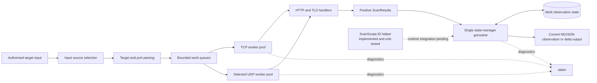
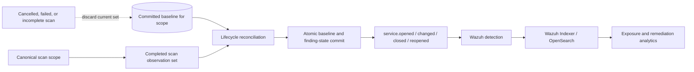

# TcpRecon System Architecture

> **Document status:** This document separates verified current behaviour from target architecture. A component is described as **implemented** only when it exists on the active branch and has supporting verification. **Planned** sections describe the intended vertical slice and must not be read as current runtime behaviour.

## 1. Purpose and scope

TcpRecon is a Go-based authorised network-observation engine. It performs TCP full-connect reconnaissance and selected UDP probes, collects service metadata, and stores positive observations in bbolt. Repeated executions are intended to support attack-surface monitoring, but complete service lifecycle reconciliation is still under development.

The project is not intended to outperform or replace mature scanners. Its engineering objective is to demonstrate a complete and reproducible pipeline:

```text
network observation → normalized state → lifecycle event → detection → analysis → remediation evidence
```

The scanner and observation-state foundations exist. Lifecycle events, stable baseline promotion, Wazuh detection, and OpenSearch remediation analytics remain later parts of the vertical slice unless a section explicitly states otherwise.

## 2. Design principles

1. **Correctness before scale.** Input parsing, cancellation, state classification, and event semantics must be trustworthy before throughput is optimized.
2. **Bounded concurrency.** Worker pools and bounded channels prevent unbounded goroutine and memory growth.
3. **Controlled network impact.** A global rate limiter controls probe starts independently of concurrency.
4. **Atomic telemetry.** Each NDJSON line contains one observation or lifecycle event.
5. **Single ownership of persistent state.** A dedicated goroutine serializes bbolt writes.
6. **No false remediation.** Partial or cancelled scans cannot replace a complete baseline.
7. **Reproducible operations.** Wazuh rules, fixtures, mappings, dashboards, and deployment instructions belong in Git.
8. **Honest claims.** Performance and reliability claims require tests and published evidence.

## 3. System context

### 3.1 Current scanner pipeline

**Status: implemented, with known lifecycle limitations.**



Current limitations relevant to Phase B:

- workers emit positive observations only;
- channel closure proves that workers exited, not that the scan completed successfully;
- target-resolution failures may skip work without producing an explicit failed-scan result;
- bbolt updates currently occur per received observation rather than after complete-scan reconciliation;
- the stable scope-ID helper is not yet wired into CLI orchestration, scanner execution, or persistent state.

### 3.2 Target lifecycle vertical slice

**Status: planned.**



A cancelled, failed, partial, or unresolved scan must preserve the previous committed baseline and must not generate `service.closed`.

## 4. Major components

### 4.1 Input source selection

Target input may originate from a positional target, local file, standard input, or an authorised remote list. Input-source selection must be explicit and mutually unambiguous.

Required behaviour:

- reject multiple conflicting sources;
- reject excessive positional arguments;
- validate URLs before network fetching;
- resolve hostnames without terminating the whole process on one failure;
- preserve target identity alongside resolved addresses;
- stream large sources instead of loading them completely into memory.

### 4.2 Streaming parser

The parser reads through `io.Reader` and produces scan jobs. Large individual CIDRs should eventually be expanded incrementally so producer memory remains bounded.

The parser is subject to backpressure. When work queues fill, parsing pauses until workers consume jobs.

### 4.3 Dispatcher and worker pools

The dispatcher routes jobs to protocol-specific worker pools.

- TCP workers use full-connect scanning through context-aware dials.
- UDP workers send selected protocol-aware payloads and classify positive replies conservatively.
- Channel direction types document ownership and prevent accidental misuse.
- `sync.WaitGroup` and channel-closure ownership are centralised.
- Worker counts are validated and bounded.

Concurrency controls the number of simultaneous operations. The rate limiter controls how quickly new probes begin. These are separate dimensions.

### 4.4 Network operations

Socket operations require deadlines. TCP dials use the shared context. UDP cancellation still needs explicit review because a blocking UDP operation must not be mistaken for successful completion.

TCP observations distinguish established connections from operational failure. A timeout alone must not be presented as proof of firewall filtering or service closure.

UDP classification is protocol-dependent and more uncertain. Positive application responses are stronger evidence than silence.

### 4.5 Protocol metadata

HTTP handlers may send a bounded request to client-first services. TLS handlers may use SNI when a hostname is available and collect available certificate metadata.

Current metadata support and later enrichment must remain distinct. Negotiated TLS version, cipher suite, validity period, and verification result belong to later verified work unless supported by tests on the active branch.

Reads and banners must be size-limited. Raw server content is untrusted input and must not produce unbounded events.

### 4.6 Observation normalization

Internal worker structures should not become the long-term public telemetry contract. A dedicated event model will isolate lifecycle events from implementation details.

Stable comparison inputs may include:

- protocol;
- normalized IP address;
- port;
- service state;
- normalized service name;
- bounded normalized banner;
- certificate fingerprint or selected stable certificate fields.

Unstable fields must not influence observation fingerprints:

- scan timestamp;
- latency;
- event ID;
- temporary OS error text;
- worker, rate, or timeout settings.

### 4.7 Stable scan-scope identity

**Status: implemented and unit-tested in isolation; runtime integration pending.**

`internal/scanner/scope.go` defines `ScanScope` and derives a deterministic ID from a versioned canonical representation containing:

- normalized target definitions;
- a deduplicated and sorted TCP port set;
- a deduplicated and sorted UDP port set.

Separate TCP and UDP port lists encode the protocol dimension, so TCP port 53 and UDP port 53 produce different scope identities.

Target canonicalization currently:

- trims surrounding whitespace;
- lowercases hostnames and removes a trailing dot;
- masks CIDRs to their network prefix;
- canonicalizes IPv4 and IPv6 text through `net/netip`;
- unmapped IPv4-mapped IPv6 addresses to their IPv4 form.

The canonical value is serialized as JSON and hashed with SHA-256. The schema version is included in the canonical value so future identity changes can be explicit rather than silently reinterpreting prior IDs.

The following execution settings are intentionally excluded:

- worker count;
- rate limit;
- timeout;
- timestamps;
- scan duration;
- scan ID.

Canonicalization builds new slices before sorting, so `ID()` does not mutate caller-owned target or port slices.

Verified tests cover:

- reordered and duplicated equivalent inputs producing the same ID;
- changed targets producing a different ID;
- changed TCP or UDP port sets producing a different ID;
- TCP and UDP separation;
- execution settings not affecting identity;
- hostname, CIDR, IPv6, and whitespace normalization;
- absence of caller-slice mutation.

Current limitation: the CLI does not yet preserve and pass a canonical `ScanScope` into scanner execution or bbolt state. The helper therefore cannot yet prevent cross-scope reconciliation mistakes at runtime.

### 4.8 State manager and bbolt

**Current status: positive-observation hashing and suppression exist. Complete lifecycle storage is planned.**

Workers do not write directly to bbolt. They send scan results to a single state-manager goroutine.

The target database schema requires explicit metadata and scoped state such as:

```text
metadata/schema_version
metadata/created_at
scope/<scope_id>/baseline/...
scope/<scope_id>/scan/<scan_id>/...
finding/<finding_id>/...
```

State keys must include protocol, address, and port. TCP and UDP observations for the same numbered port are separate services.

## 5. Lifecycle reconciliation

**Status: contract defined; implementation pending.**

Hash suppression alone detects first-seen or changed positive observations, but cannot reliably detect service closure. Complete lifecycle tracking compares a successfully finished scan with the previous committed baseline for the same scope.

```text
current - previous                         = opened
current ∩ previous with different hash    = changed
previous - current                         = closed
previously closed and observed again       = reopened
```

### 5.1 Commit rule

A scan baseline may be committed only when:

- all intended target and port jobs were produced;
- worker processing completed;
- the process was not cancelled;
- no fatal parser, resolution, or state error made the scan incomplete.

Temporary observations are discarded after incomplete scans. This prevents an outage, parser failure, or Ctrl+C from being reported as successful remediation.

### 5.2 Stable identifiers

| Identifier | Contract | Current status |
|---|---|---|
| `scan_id` | Unique to one execution | Planned |
| `scope_id` | Stable hash of canonical targets plus separate TCP and UDP port sets | Helper implemented and tested; runtime integration pending |
| `finding_id` | Stable identity of one service finding within a scope | Planned |
| `event_id` | Unique lifecycle event identity | Planned |

Worker count, rate limit, timeout, timestamps, and duration do not belong in `scope_id`.

## 6. Event pipeline

**Current status:** TcpRecon can emit machine-readable observation or delta records while diagnostics belong on stderr.

**Target status:** TcpRecon emits one versioned NDJSON object per lifecycle or operational event.

```text
stdout → telemetry only
stderr → diagnostics only
```

The planned lifecycle vocabulary is:

- `service.opened`
- `service.changed`
- `service.closed`
- `service.reopened`
- optional operational events such as `scan.failed`

The canonical lifecycle schema will be documented in `docs/EVENT_SCHEMA.md` when its fields and semantics are implemented and verified.

## 7. Wazuh integration

**Status: planned and dependent on verified lifecycle events.**

Wazuh will read the event file using a JSON `<localfile>` configuration. Repository-owned integration assets should be arranged as:

```text
deployments/wazuh/
├── README.md
├── config/
│   └── tcprecon-localfile.xml
├── rules/
│   └── tcprecon_rules.xml
├── fixtures/
│   ├── service-opened.ndjson
│   ├── service-changed.ndjson
│   ├── service-closed.ndjson
│   └── deprecated-tls.ndjson
└── scripts/
    ├── install-rules.sh
    └── uninstall-rules.sh
```

Rule design should separate:

1. base event recognition;
2. lifecycle classification;
3. policy violations;
4. asset context;
5. risk escalation.

An open SSH port is not automatically a critical incident. Severity depends on context such as approval, exposure, vulnerability, change status, and asset criticality.

Every fixture must be tested with `wazuh-logtest` before manager restart.

## 8. OpenSearch analytics

**Status: planned and dependent on reproducible Wazuh ingestion.**

Dashboard-critical fields require explicit mappings:

| Field type | Mapping |
|---|---|
| IP address | `ip` |
| port, risk score | numeric |
| timestamps | `date` |
| event type, severity, reason code | `keyword` |
| owner, environment, criticality | `keyword` |
| explanations and long banners | `text` plus bounded keyword fields only where justified |

Numeric fields should not be forced into `.keyword` mappings. FieldData should not be enabled merely to aggregate analyzed text.

Planned dashboards include current exposure, service changes, unresolved risk, deprecated TLS, certificate expiry, and remediation duration.

## 9. Deployment architecture

### 9.1 Container

**Status: repository baseline exists; current runtime verification should be recorded separately.**

The intended container uses a multi-stage build and a minimal runtime:

- static Go binary;
- no shell or package manager;
- CA certificates and timezone data copied explicitly;
- unprivileged UID;
- read-only root filesystem where possible;
- all Linux capabilities dropped.

### 9.2 Kubernetes

**Status: repository baseline exists; lifecycle safety is not complete.**

Scheduled execution uses a CronJob with:

- `concurrencyPolicy: Forbid`;
- a `ReadWriteOnce` persistent volume for bbolt;
- `DB_PATH` directed into the writable mount;
- resource requests sized for the lab;
- bounded scan scope and frequency.

bbolt's exclusive file lock makes overlapping writers invalid by design.

### 9.3 Wazuh lab baseline

**Status: deployment target, not evidence that the stack is currently running.**

The planned lab baseline is a dedicated Ubuntu Server 24.04 LTS host with constrained hardware. Deployment status, package versions, and installation commands belong in operations or status documentation because they change independently of scanner architecture.

## 10. CI/CD and GitOps

Pull requests and pushes should verify:

```bash
gofmt verification
go vet ./...
go test ./...
go test -race ./...
go build ./cmd/tcprecon
```

Release automation may build immutable OCI images. Generated binaries, credentials, local state databases, certificates, and password archives must not be committed.

## 11. Security boundaries

- The scanner operates only within explicit authorised scope.
- Remote target lists are untrusted input and require HTTPS, size limits, timeouts, and validation.
- Banners and certificate fields are untrusted and must be bounded before logging.
- Secrets for registries, Wazuh, Slack, or other integrations remain outside Git.
- Rate limiting protects local and target resources; it is not an evasion mechanism.
- Telemetry integrity matters because mixed stdout can corrupt downstream detection.

## 12. Verification strategy

### 12.1 Verified in the current scope-identity change

```bash
go test -count=1 ./internal/scanner -run ScanScope
go test -count=1 ./internal/scanner
go test -race -count=1 ./internal/scanner
go vet ./internal/scanner
git diff --check
```

These checks verify deterministic scope identity, normalization, protocol separation, and absence of input-slice mutation. They do not prove runtime integration or lifecycle reconciliation.

### 12.2 Planned unit tests

- service-key construction;
- stable finding identity;
- bbolt schema versioning;
- scan completion and cancellation state;
- lifecycle-set reconciliation;
- event serialization;
- restart persistence.

### 12.3 Local integration tests

- loopback TCP listener;
- closed local port;
- local HTTP and TLS test servers;
- selected UDP responders;
- deadline and cancellation behavior;
- stdout/stderr separation;
- database restart and migration behavior.

### 12.4 Target end-to-end lab test

1. Start an authorised lab service.
2. Complete a scan and emit `service.opened`.
3. Repeat the scan and emit no duplicate lifecycle event.
4. Change the service and emit `service.changed`.
5. Stop the service and emit `service.closed`.
6. Restart it and emit `service.reopened`.
7. Confirm Wazuh decoding and expected rule matches.
8. Confirm OpenSearch fields and dashboard visibility.

## 13. Deliberate non-goals

Until the vertical slice is complete, the project will not prioritize:

- distributed scanner coordination;
- Kafka or large streaming platforms;
- broad vulnerability detection;
- Internet-wide scanning;
- complex multi-tenant dashboards;
- performance claims without reproducible benchmarks.

## 14. Historical evolution

The project began as a Python `socket` prototype, moved to Go worker pools, added application-layer and TLS metadata, introduced rate limiting and cancellation, separated telemetry from diagnostics, adopted bbolt-based observation suppression, and added container and Kubernetes deployment baselines.

Wazuh detection, OpenSearch analytics, complete lifecycle reconciliation, and remediation tracking remain target work until they have reproducible implementation evidence.
